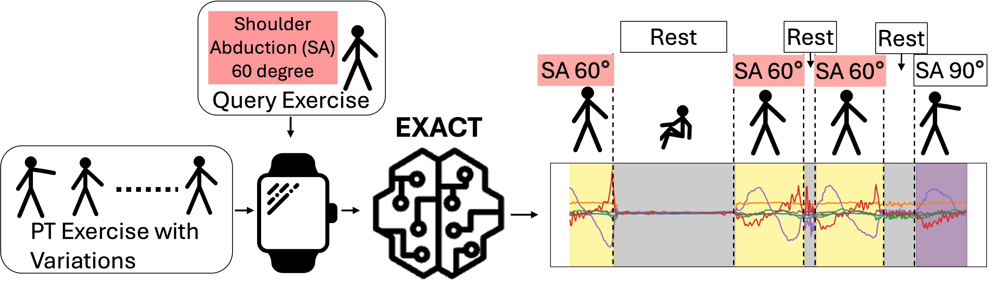

# EXACT: A Meta-Learning Framework for Precise Exercise Segmentation in Physical Therapy

This repository provides an implementation for meta-learning on dense labeling tasks using various deep learning models. The project includes customizable support for models and datasets, with augmentation, training, and evaluation configurations. It leverages the WandB logging framework for experiment tracking.





## Table of Contents
- [Installation](#installation)
- [Usage](#usage)
- [Arguments](#arguments)
- [Supported Models](#supported-models)
- [Supported Datasets](#supported-datasets)
- [Example Commands](#example-commands)
<!-- - [License](#license) -->

## Installation

1. Clone this repository:
    ```bash
    git clone https://github.com/yourusername/yourproject.git
    cd yourproject
    ```
2. Install dependencies:
    ```bash
    pip install -r requirements.txt
    ```
3. Install WandB for experiment tracking (optional):
    ```bash
    pip install wandb
    ```

## Usage

To train a model, use:
```bash
python main.py --dataset <dataset_name> --model <model_name> --data_root <path_to_data>
```

Example:
```bash
python main.py --dataset physiq --model unet --data_root ./data
```

## Arguments

### Main Parameters

- `--data_root`: Root directory for the dataset.
- `--dataset`: Dataset to use for training (`physiq`, `spar`, `mmfit`).
- `--model`: Model to use for training (`unet`, `transformer`, `ex`, `segmenter`, `cnn`).

### Dataset-Specific Parameters

- `--window_size`: Window size for sliding window (default: 500).
- `--window_step`: Step size for sliding window (default: 25).
- `--rotation_chance`: Probability of applying random rotation to data (default: 0).

### Training Parameters

- `--lr`: Learning rate for the meta-optimizer (default: 1e-3).
- `--meta_lr`: Learning rate for the inner optimizer (default: 1e-2).
- `--n_inner_iter`: Number of inner-loop iterations (default: 1).
- `--n_epochs`: Number of training epochs (default: 30).
- `--device`: Device to use for training (default: "cuda").

### WandB Logging

- `--wandb_project`: Name of the WandB project for logging experiments.
- `--nowandb`: Disable WandB logging.

### Cross-Validation

- `--loocv`: Enable Leave-One-Out Cross-Validation.

For a complete list of options, please refer to the `get_args` function in the main script.

## Supported Models

- **UNet**: Designed for dense labeling with encoder-decoder architecture.
- **Transformer**: Transformer model adapted for dense labeling tasks.
- **EX (EXACT)**: Custom model for dense labeling.
- **Segmenter**: A model for segmentation tasks.
- **CNN**: Simple Convolutional Neural Network for dense labeling tasks.

## Supported Datasets
Please go to data folder to download the datasets.
<!-- a hyperlink to that readme -->
- **[dataset README](./data/README.md)**

- **PhysiQ**: Dataset with IMU data used for exercise and physical activity monitoring.
- **SPAR**: Another IMU-based dataset.
- **MMFIT**: Dataset for physical fitness with dense labeling tasks.

## Example Commands

Training a UNet on the PhysiQ dataset:
```bash
python main.py --dataset physiq --model unet --window_size 500 --window_step 25 --n_epochs 30 --lr 1e-3
```

Using WandB logging:
```bash
python main.py --dataset spar --model transformer --wandb_project EXACT
```

Leave-One-Out Cross-Validation:
```bash
python main.py --dataset mmfit --model segmenter --loocv
```


